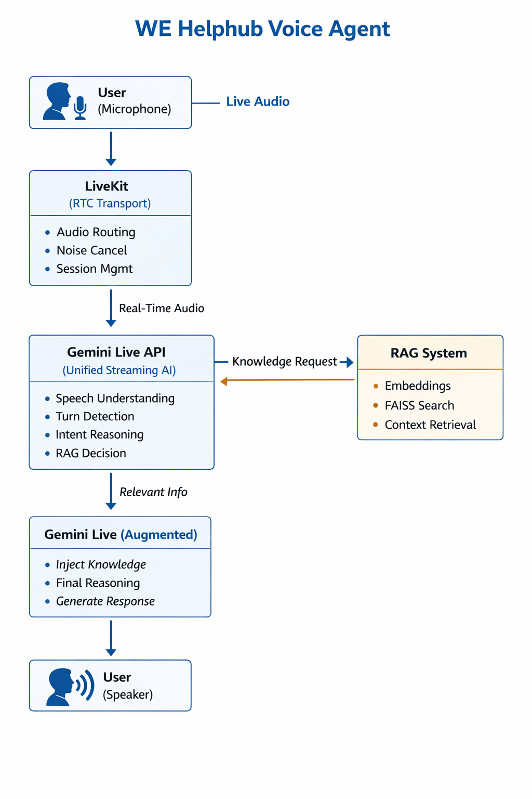

# 🧠 WE-Helphub - AI Voice Agent 

This is a real-time voice AI agent driven by LiveKit and the Google Gemini Live API, capable of:

- 🔍 Searching the web  
- 🌤️ Weather checking
- 📨 Sending Emails 
- 📚➡️🧠 RAG Integrated to Retrive Context from a knoweledge base before responding (Knowledge grounding)
- 📷 Vision through camera (Web app)
- 🗣️ Speech
- 📝 Chat (Web app) 

This agent powered by LiveKit and Real-time model Gemini Live API. 

---
# Task Objective
  - Build a working prototype of a LiveKit Voice Agent that uses Gemini Live API as 
    its core intelligence and integrates a RAG system for context-aware responses. The 
    system should provide a web interface for users to interact with the voice agent in 
    real-time.

--- 
# 🏗️🧠🔍📚 Architecture

    Flow : 
    
    When the user activates the microphone, 
    audio is streamed via LiveKit to the Gemini 
    Live API. Gemini performs real-time speech 
    understanding and turn detection, decides when 
    external knowledge is required, invokes the 
    RAG system to retrieve relevant context, 
    integrates that knowledge into its reasoning, 
    and streams the final response back as 
    audio — without any explicit STT or TTS layers.
 

---
1. Create the virtual environment first!
2. Activate it
3. Install all of the required libraries from the requirements.txt file.

4. In the.ENV file, enter your API keys, LiveKit Secret, and LiveKit URL.
   If you want to use the Send Email Tool, enter your Gmail account and app password. 
5. Ensure that your LiveKit account is properly configured. 
6. To test the voice agent through the frontend (simple web UI), make sure to follow the steps in the frontend agent README file.
---

# ➡️ Retrival Step

## From high-level overview:
 [screenshot](./.github/assets/high.png)

## From low-level overview:
 [screenshot](./.github/assets/low.png)

### Sample from knoweledge base(original texts)
 [screenshot](./.github/assets/sample.png)

---

# 🛠️ Running the Project 
This project is split into two parts:

--> Python voice agent (LiveKit + Gemini + RAG)

--> React frontend

During development, each part is run independently in its own terminal.
This keeps things simple, flexible, and easy to debug.

1. Start the Voice Agent (Backend)
Open terminal and run: python agent.py dev
note: ensure to activate the created environment first.

This starts the LiveKit voice agent in development mode and connects it to Gemini Live and the RAG system.

2. Start the Frontend (web UI)
Open terminal and run: pnpm dev

This starts the app , paste the url http://localhost:3000/ in your browser and hit the talk button.

---
